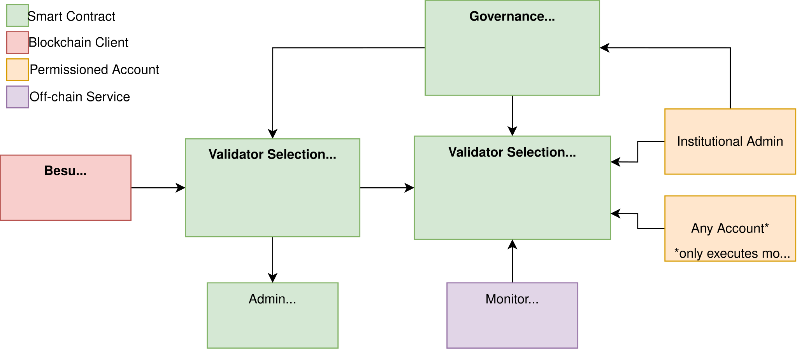

# Especificação Técnica Simplificada — Seleção de Validadores RBB

Este documento unifica e simplifica a especificação técnica dos contratos de Seleção de Validadores da Rede Blockchain Brasil (RBB), com foco exclusivo nas necessidades do desenvolvedor de contratos inteligentes.

---

## 1. Visão Geral da Arquitetura e Regras de Segurança

O sistema é composto por **2 contratos** e um componente _off-chain_ para o monitoramento:

### 1.1 Contratos e Objetivos

* **`ValidatorSelectionIngress`**: Ponto de entrada fixo (fachada) para o Besu consultar validadores operacionais. Evita *hard forks* ao permitir atualização do contrato de lógica por baixo. Delega todas as chamadas de `getValidators()` ao contrato de lógica.
* **`ValidatorSelection`**: Implementa a lógica de gestão e seleção automática de validadores (modos Manual/Automatic) e integrações com o permissionamento.

### 1.2 Regras de Controle de Acesso e Papéis

| Papel | Permissões | Verificação (Requisitos de Segurança) |
|-------|-----------|-------------|
| **Governança** | Modificar parâmetros, alterar contratos de lógica, adicionar/remover elegíveis. | Modificador `onlyGovernance` que valida via `AdminProxy.isAuthorized(msg.sender)`. |
| **Global Admin** | Adicionar ou remover operacionais da própria organização. | `AccountRulesV2.hasRole(GLOBAL_ADMIN_ROLE, msg.sender)` + `isAccountActive(msg.sender)` + correspondência do `orgId`. |
| **Local Admin** | Adicionar ou remover operacionais da própria organização. | `AccountRulesV2.hasRole(LOCAL_ADMIN_ROLE, msg.sender)` + `isAccountActive(msg.sender)` + correspondência do `orgId`. |
| **Qualquer Conta** | Acionar `executeMonitoring()` e realizar consultas `view`. | Sem restrições de acesso. |

### 1.3 Invariantes Críticas de Dados

O código deve assegurar e manter consistentes as seguintes regras:
1. **`operationalValidators ⊆ eligibleValidators`**: Um validador só pode ser operacional se for elegível.
2. **`protectedValidators ⊆ operationalValidators`**: Validadores protegidos temporariamente devem estar no conjunto operacional.
3. **Mínimo de Validadores Operacionais:**
   * A governança (remoção manual) pode remover validadores operacionais até restar no mínimo `1` validador operacional ativo no conjunto.
   * Administradores (remoção manual) podem remover validadores operacionais até restar no mínimo `4` validadores operacionais ativos no conjunto.
   * A seleção automática (remoção via monitoramento) só pode remover validadores operacionais se restarem no mínimo `4` validadores operacionais ativos no conjunto.

### 1.4 Decisões Arquiteturais Relevantes

* **DA-01 (Sem Proxy de Storage):** O contrato `ValidatorSelection` é convencional e não utiliza proxies (como UUPS). A atualização é feita implantando um novo contrato estático e atualizando o endereço no `Ingress`. O compilador gerencia o storage livremente.
* **DA-02 (Validação try/catch):** A validação se um endereço implementa as interfaces (`isAuthorized`, `getValidators`) deve ser feita via chamada externa com `try/catch` para suportar contratos legados que não usam ERC-165.
* **DA-03 (Desacoplamento e Baixo Acoplamento com Permissionamento):** O cadastro e a adição de validadores elegíveis ou operacionais pelo contrato de seleção não fazem validações diretas de estado contra outros contratos de permissionamento da RBB para evitar alto acoplamento e complexidade desnecessária.
* **Diretriz de Segurança (Padrão Checks-Effects-Interactions):** Todas as funções que realizam chamadas externas devem seguir o padrão *checks-effects-interactions* (CEI) para mitigar riscos de reentrância. As validações (checks) e atualizações de estado (effects) devem ser executadas antes de qualquer chamada externa (interactions).

---

## 2. Modelo de Dados e Interfaces

Esta seção apresenta a estrutura de dados (storage), as interfaces em Solidity, os eventos emitidos para fins de auditoria e os erros customizados de cada contrato.

A especificação detalhada dessa seção está disponível no arquivo específico: **[01-modelo-contratos.md](./01-modelo-contratos.md)**

### Conteúdo disponível no documento de Modelo de Dados:
- **Estado (Storage)**: Variáveis de estado e mapeamentos dos contratos `ValidatorSelectionIngress` e `ValidatorSelection`.
- **Interface Comum (Solidity)**: Assinaturas de funções, declarações de enums (`OperationMode`) e suporte ao padrão ERC-165.
- **Assinaturas de Eventos**: Definição completa de logs de auditoria e rastreabilidade para ambos os contratos.
- **Erros Customizados**: Relação de erros que otimizam o consumo de gás e fornecem diagnóstico claro de falhas.

---

## 3. Especificação Detalhada das Funções

Esta seção detalha o comportamento esperado de cada função exposta nos contratos inteligentes, descrevendo seus parâmetros, requisitos de acesso (papéis autorizados), validações necessárias, efeitos colaterais e os algoritmos de execução internos.

A especificação detalhada de cada função está disponível no arquivo específico: **[02-especificacao-funcoes.md](./02-especificacao-funcoes.md)**

### Conteúdo disponível no documento de Especificação Detalhada:
- **ValidatorSelectionIngress**:
  - `constructor`
  - `getValidators` (incluindo algoritmo com fallback para `block.coinbase`)
  - `updateValidatorSelectionContract`
  - `updateAdminContract`
  - `removeValidatorSelectionContract`
  - `removeAdminContract`
  - `supportsInterface`
  - Consultas diretas (`validatorSelectionContract`, `admins`)
- **ValidatorSelection**:
  - `constructor`
  - `setOperationMode` (com regras de transição para o modo automático)
  - `executeMonitoring` (detalhando as três fases do algoritmo: identificação de inativos, filtro e remoção respeitando o limite mínimo de operacionais, e reset do ciclo)
  - `addOperationalValidator` (via Enode e via Endereço)
  - `removeOperationalValidator` (via Enode e via Endereço, respeitando a invariante mínima)
  - `addEligibleValidator` (com ajuste automático de parâmetros)
  - `removeEligibleValidator` (com remoção segura de elegíveis e operacionais, e otimização de gás)
  - `setSelectionParameters`
  - Reponteiramento dinâmico de contratos (`updateAdminContract`, `updateAccountsContract`, `updateNodesContract`)
  - Consultas de conjuntos (`getEligibleValidators`, `getValidators`)
  - ERC-165 (`supportsInterface`)