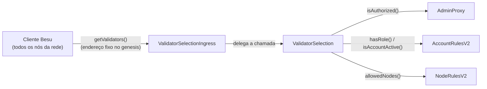
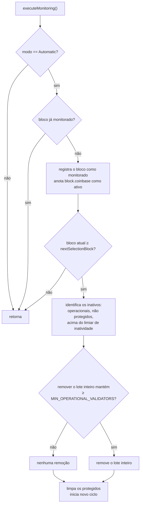

# Seleção de Validadores — Referência Técnica dos Contratos

Arquitetura, modelo de dados e interface dos contratos `ValidatorSelection` e `ValidatorSelectionIngress`.

Para instruções de pré-requisitos, compilação, testes e o procedimento de implantação/transição de gênesis em produção, consulte [`README.md`](../README.md). Para a especificação formal contendo histórias de usuário e critérios de aceite, consulte [`doc/`](../doc/README.md).

## Sumário

1. [Arquitetura dos Contratos](#1-arquitetura-dos-contratos)
2. [Conjuntos de Validadores](#2-conjuntos-de-validadores)
3. [Modos de Operação](#3-modos-de-operação)
4. [Algoritmo de Monitoramento Automático](#4-algoritmo-de-monitoramento-automático)
5. [Pisos de Segurança](#5-pisos-de-segurança)
6. [Controle de Acesso](#6-controle-de-acesso)
7. [Interface e Funções Principais](#7-interface-e-funções-principais)
8. [Erros Customizados](#8-erros-customizados)

---

## 1. Arquitetura dos Contratos

* `ValidatorSelectionIngress`: Ponto de entrada fixo consultado pelo Besu e único endereço registrado no arquivo de gênesis. Não contém lógica de negócio; repassa a chamada `getValidators()` ao contrato de lógica registrado (`validatorSelectionContract`), atualizável via `updateValidatorSelectionContract` pela governança. Declara `getValidators()` por meio da interface [`IValidatorList`](interfaces/IValidatorList.sol).
* `ValidatorSelection`: Contrato estático com a regra de negócio completa: elegibilidade, estado operacional, parâmetros e algoritmo de monitoramento.

A separação em dois contratos evita a necessidade de novas transições de gênesis (*hard forks*) a cada atualização da regra de negócio ([DA-01](../doc/arquitetura/01-visao-geral.md#da-01)).

Caso o Ingress não obtenha uma lista válida do contrato de lógica (endereço não registrado, chamada revertida ou lista vazia), ele retorna uma lista contendo apenas o proponente do bloco atual (`block.coinbase`) como salvaguarda para impedir a parada do consenso ([DA-07](../doc/arquitetura/01-visao-geral.md#da-07)).

## 2. Conjuntos de Validadores

`ValidatorSelection` mantém três conjuntos de endereços (`EnumerableSet.AddressSet`), sujeitos à relação de inclusão `protectedValidators ⊆ operationalValidators ⊆ eligibleValidators`:

| Conjunto | Descrição |
|---|---|
| **Elegíveis** (`eligibleValidators`) | Nós aprovados pela governança como aptos a integrar o consenso. |
| **Operacionais** (`operationalValidators`) | Subconjunto dos elegíveis que participa ativamente do consenso no momento (retornado por `getValidators()`). |
| **Protegidos** (`protectedValidators`) | Subconjunto temporário dos operacionais, imune à remoção automática durante o ciclo de monitoramento em curso. |

No deploy, o construtor popula os três conjuntos simultaneamente com a lista inicial informada.

O conjunto de protegidos é esvaziado ao final de cada seleção (`_clearProtectedValidators`). Após o deploy, alteração de modo (`setOperationMode(Automatic)`) ou reconfiguração de parâmetros (`setSelectionParameters`), todo o conjunto operacional entra em proteção: o primeiro ciclo apenas consome a proteção vigente, permitindo remoções automáticas somente a partir do segundo ciclo.

## 3. Modos de Operação

O contrato opera em um dos dois modos de operação (`operationMode`):

* `Manual` (0): modo inicial pós-deploy. Os conjuntos só são alterados por ações explícitas de governança ou administradores. Não há remoção automática.
* `Automatic` (1): habilita a monitoração automática de disponibilidade. Alterado pela governança via `setOperationMode`.

Ao transicionar para `Automatic`, o contrato protege todo o conjunto operacional vigente e inicia um novo ciclo.

## 4. Algoritmo de Monitoramento Automático

A função `executeMonitoring()` pode ser chamada por qualquer conta. Cada chamada registra o bloco atual como monitorado e anota o proponente (`block.coinbase`) como ativo. A reavaliação do conjunto operacional ocorre quando o bloco atual atinge `nextSelectionBlock`:

O algoritmo é controlado por dois parâmetros ajustáveis via `setSelectionParameters`:

* `blocksBetweenSelection`: intervalo em blocos entre avaliações do conjunto operacional.
* `blocksWithoutProposeThreshold`: limite de blocos inativos a partir do qual um validador é considerado inoperante.

Regras de execução do algoritmo:

* **Remoção em lote (tudo-ou-nada):** O contrato calcula a lista completa de inativos e só executa a remoção se a sobra final mantiver ao menos `MIN_OPERATIONAL_VALIDATORS` operacionais; caso contrário, nenhum nó é removido ([DA-06](../doc/arquitetura/01-visao-geral.md#da-06)). Os casos E2E `05-piso-veta-lote` e `06-lote-removido-com-folga` ([`test/e2e/`](../test/e2e/README.md)) exercitam essa regra.
* **Medição por ciclo:** O piso para o cálculo de inatividade é `cycleStartBlock`. A cada novo ciclo, o contador de blocos sem propor é reiniciado para todos os validadores.

## 5. Pisos de Segurança

| Constante | Valor | Aplicação |
|---|---|---|
| `MIN_INITIAL_ELIGIBLE_VALIDATORS` | 1 | Tamanho mínimo da lista inicial no deploy. |
| `MIN_OPERATIONAL_VALIDATORS` | 4 | Piso da remoção automática e da remoção manual por administrador de organização. |
| `MIN_GOV_OPERATIONAL_VALIDATORS` | 1 | Piso da remoção manual pela governança. |

O piso de 4 nós corresponde ao quórum mínimo de uma rede QBFT de 6 validadores (abaixo disso, a produção de blocos é interrompida; ver caso E2E `07-quebra-de-quorum`).

## 6. Controle de Acesso

| Papel | Permissões | Verificação |
|---|---|---|
| **Governança** | Alterar modo e parâmetros, adicionar/remover elegíveis, adicionar/remover operacionais (piso de 1), atualizar os contratos de admin/contas/nós. | `AdminProxy.isAuthorized(msg.sender)` (modificador `onlyGovernance`). |
| **Administrador Global/Local** | Adicionar/remover validadores operacionais da própria organização (piso de 4). | `AccountRulesV2.hasRole(...)` + conta ativa + correspondência de `orgId` entre admin e nó. |
| **Qualquer conta** | `executeMonitoring()` e todas as funções de consulta. | Sem restrição de acesso por definição de projeto. |

As funções que recebem parâmetros de enode (`addOperationalValidator`, `removeOperationalValidatorByAdmin`, etc.) validam o vínculo organizacional do nó. Administradores de organização devem utilizar as variantes por enode.

Para a tabela completa de regras de acesso e justificativas, consulte [`doc/arquitetura/01-visao-geral.md`](../doc/arquitetura/01-visao-geral.md).

## 7. Interface e Funções Principais

| Função | Descrição |
|---|---|
| `getValidators()` | Retorna o conjunto operacional atual (consultado pelo Besu via Ingress a cada rodada do consenso). |
| `getEligibleValidators()` / `getProtectedValidators()` | Consulta dos demais conjuntos. |
| `isEligible(addr)` / `isOperational(addr)` / `isProtected(addr)` | Consulta de pertencimento individual a cada conjunto. |
| `setOperationMode(mode)` | Altera o modo de operação (governança). |
| `setSelectionParameters(a, b)` | Ajusta os parâmetros do ciclo automático (governança). |
| `executeMonitoring()` | Registra a produção do bloco atual e executa a reavaliação do ciclo. |
| `addEligibleValidator(...)` / `removeEligibleValidator(...)` | Inclusão e exclusão no conjunto de elegíveis (governança). |
| `addOperationalValidator(...)` / `removeOperationalValidator...(...)` | Ativação e desativação manual de nó elegível (governança ou administrador de organização). |
| `updateAdminContract` / `updateAccountsContract` / `updateNodesContract` | Reponteia os contratos externos de permissionamento (governança). |
| `supportsInterface(interfaceId)` | Implementação ERC-165 (retorna `true` para `IERC165`, `IValidatorSelection` e `IValidatorList`). |

Para a especificação detalhada de funções, validações e efeitos colaterais, consulte [`doc/especificacao-tecnica/02-especificacao-funcoes.md`](../doc/especificacao-tecnica/02-especificacao-funcoes.md).

## 8. Erros Customizados

| Erro | Situação |
|---|---|
| `InvalidAddress()` | Endereço informado igual a `address(0)`. |
| `NotEligibleNode(addr)` | Tentativa de ativar nó não elegível como operacional. |
| `AlreadyOperationalNode(addr)` | Nó já presente no conjunto operacional. |
| `FewEligibleValidators()` | Lista inicial vazia no deploy. |
| `FewOperationalValidators()` | Remoção manual reduz o conjunto operacional abaixo do piso mínimo do papel. |
| `InvalidOperationMode()` | Modo diferente de `Manual` ou `Automatic`. |
| `UnauthorizedAccess(addr)` | Chamador sem a permissão exigida pela função. |
| `NotLocalNode(enodeHigh, enodeLow)` | Administrador alterando nó de outra organização. |
| `InvalidAdminContract(addr)` / `InvalidAccountsContract(addr)` / `InvalidNodesContract(addr)` | Contrato em atualização não respondeu à chamada de validação esperada. |

Para a lista completa contendo os parâmetros e histórico de requisitos, consulte [`doc/especificacao-tecnica/01-modelo-contratos.md`](../doc/especificacao-tecnica/01-modelo-contratos.md).
